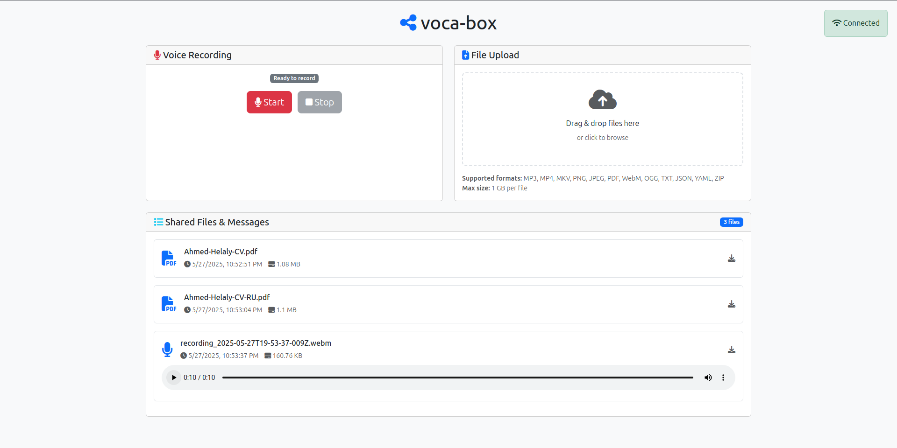

# voca-box ⏺️

A lightweight web application for real-time file sharing with voice recording capabilities.



## ✨ Features

- real-time updates 
- voice recording / playback 
- file upload / download 
- responsive design

## 🚀 Start

```bash
go run main.go
```

The application will start on `http://localhost:3000`

## 📁 Structure

```
voca-box/
├── main.go          # backend server
├── go.mod           # module file
├── index.html       # frontend HTML file
└── README.md        # current file
```

## 📡 API

| Method | Endpoint       | Description                                |
|--------|----------------|--------------------------------------------|
| GET    | `/`            | Serves the frontend HTML                   |
| POST   | `/upload`      | Upload files (multipart/form-data)         |
| POST   | `/record`      | Upload recorded audio (same as /upload)    |
| GET    | `/messages`    | Get list of all uploaded files             |
| GET    | `/message/:id` | Download or stream a specific file         |
| GET    | `/formats`     | Get supported file formats and size limits |
| WS     | `/ws`          | WebSocket endpoint for real-time updates   |

## 📝 License

This is a demo application. Use at your own risk.
